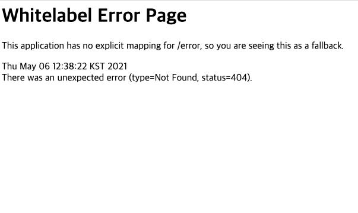

# SpringBoot 간단한 Error처리 방법

## 거창한 에러처리방법 말고...

SpringBoot에서는 특정상황에 에러가 발생될경우 에러에 대한 모든 StackTrace가 되는 방식으로 처리된다.대체로 이런식?



거창한 에러처리방식이 아니라,가장 쉽게처리할 수 있는 방법에 대해서 알아보겠다.


### Application.yaml을 통한 properties를 통해서 가장 단순하게 에러처리를 해보자.

Try-catch는 너무 반복되는 코드를 통해서 지속적으로 적어줘야하고,ExceptionHandler등을 통해서 처리하는 방법은 복잡하기도 해서 Spring Boot에서 기본으로 제공하는 Application.properties나 yaml파일을 통해서도 처리가 가능하다.

```yaml
server:
  error:
    include-stacktrace: never
    include-exception: true
    include-binding-errors: always
    include-message: always
    path:
    whitelabel:
      enabled: true
```

하나씩 알아보도록 하자.

1. `include-stacktrace` 는 구체적으로 에러가 어디쯤에서 발생했는지에 일일히 설명하는 방식이다. 몇번째 줄쯤에서 에러가 발생했고, 그런 에러의 전파가 어디로 되는 것에 대해서 구체적으로 설명하는 방식인데, 너무 많은 정보가 노출되기 때문에, 이 옵션은 개발하는 당시에만 키고 프로덕트 옵션에서는 무조건 끄는걸 추천한다.
2. `include-exception`는 에러발생시 그 에러를 화면에 노출시킬지에 대한 옵션이다. 예를 들면.. `(()->new IllegalArgumentException("구체적인 에러 지침"));` 처럼 에러 `IllegalArgumentException`를 노출시킬 수 있다.
3. `include-binding-errors`: Validation을 한 후, 유효하지 못한 값이 존재할 때, Error\(BindingResult\)에 그 내용을 담아서 처리한다. 즉, 전달된 데이터의 유효성이 없는 경우 바인딩 에러로 처리되는데 그런 것을 노출시킬지에 대한 것.
4. `include-message`: 위에서 말했던 것처럼 예외를 노출시키는데 그 예외에 작성되어있는 메세지명을 노출시킬지에 대한 것이다.
5. `path`: 오류를 처리할 Controller path를 지정해줄 수도 있다. Error에 대한 Controller를 직접 구성해서 모든 에러를 한 곳에서 처리할 수도 있다.
6. `whitelabel enable`: Spring boot를 켰을데 가장 자주 보이는 페이지인 whitelabel 에러 페이지를 사용할지 말지를 결정한다.

이런 방식은 정말 간단하게 에러를 쉽게 처리하는 방법중하나이다.

Controller를 통해서 혹은 Try catch를 통한 방식을 통한 예외처리에 비해서 쉽고 간편하게 만들 수 있지만, 디테일한 설정은 불가능하다는 것이 단점이다. 예를 들면, API 응답에 기본 포멧이 있고 그 포멧을 통해 Error전달을 해야하는 경우는 지금의 방식으로는 어렵다.

구체적으로 표현하기 위해서는 자신이 생각하는 에러처리 방식을 맞춰서 간단하게 구성해보고, 확장적으로 Controller나 Excpetion 전략을 통해서 처리해보는 연습을 하자.


### 출처






